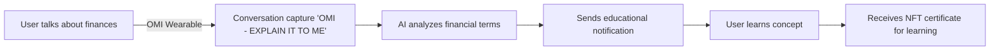

<div align="center">


# FinMentor AI Backend Service

[](https://nodejs.org/)
[](https://www.typescriptlang.org/)
[](https://yarnpkg.com/)
[](https://expressjs.com/)
[](https://blog.cleancoder.com/uncle-bob/2012/08/13/the-clean-architecture.html)
[](https://eslint.org/)
</div>

## 📑 Table of Contents
- [About the Project](#-about-the-project)
- [Tech Stack](#-tech-stack)
- [Architecture](#-architecture)
- [Getting Started](#-getting-started)
- [Configuration](#️-configuration)
- [Available Scripts](#-available-scripts)
- [API Documentation](#-api-documentation)
- [Contributing](#-contributing)
- [License](#-license)

## 💡 About the Project

Backend microservice implementing Clean Architecture and SOLID principles in TypeScript, providing financial education services through the OMI platform. This service is optimized for high availability and scalability.

### Key Features
- 🏗️ Clean and modular architecture
- 🔐 Secure API endpoints
- 📚 Financial education content management
- 💰 User financial knowledge profiles
- 🏆 Learning progress tracking and NFT certificates
- 🚀 Performance optimized with compression
- 📊 Structured logging with Winston

## 📋 Project Summary

FinMentor AI is a personal finance assistant that uses OMI technology to help beginners navigate both the traditional financial world (Web2) and the cryptocurrency and blockchain ecosystem (Web3).

## 🔍 Problem It Solves

Personal finance is already complicated for many people, and the world of cryptocurrencies adds an additional layer of complexity. FinMentor AI acts as a personal guide that listens to your conversations (through the OMI wearable) and offers contextual education and advice when it detects financial terms or concerns.

## ⚙️ Basic Operation



## ✨ Main Features

1. **Contextual Listening**: Detects financial terms in your daily conversations
2. **Personalized Education**: Offers simple explanations adapted to your level
3. **Web2-Web3 Bridge**: Helps you understand both traditional finance and cryptocurrencies
4. **Learning Certificates**: Receive NFTs when completing educational modules

## 🌟 Benefits

- Learn finance naturally, without the need for formal courses
- Receive information at the relevant moment, when you're thinking about it
- Build knowledge gradually, without feeling overwhelmed
- Gain recognition for your progress through NFTs on the OMI blockchain

## 🛠 Tech Stack

### Core
- **Runtime**: Node.js 22.11.0
- **Language**: TypeScript 5.7.2
- **Framework**: Express 4.21.1

### Infrastructure
- **Logger**: Winston
- **Security**: Helmet, HPP, Rate Limiting
- **API**: Express with compression
- **File Handling**: Multer

### Development Tools
- **Linting**: ESLint + Prettier
- **Type Checking**: TypeScript
- **Development**: ts-node-dev
- **Build**: tsc with path aliases

### Infrastructure
- **Environment**: Cross-env
- **Date Handling**: Day.js
- **Logging**: Winston with daily rotation

## 🏗 Architecture

### Clean Architecture

```plaintext
📦 src
├── 🎯 domain/
│   ├── adapters/       # Interface adapters
│   ├── aggregates/     # Domain aggregates
│   ├── dto/           # Data transfer objects
│   ├── entity/        # Domain entities
│   ├── enums/         # Enumerations
│   ├── errors/        # Custom error definitions
│   ├── events/        # Domain events
│   ├── facades/       # Facade patterns
│   ├── factories/     # Factory patterns
│   └── observers/     # Observer patterns
│
├── 🏗️ infraestructure/
│   ├── databases/     # Database implementations
│   │   ├── firestore/
│   │   ├── mongodb/
│   │   ├── postgresql/
│   │   └── redis/
│   └── services/      # Infrastructure services
│
├── 🎨 presentation/
│   ├── Bootstrap/     # Application bootstrap
│   │   ├── controllers/
│   │   ├── middlewares/
│   │   ├── routes/
│   │   └── services/
│   └── finmentor/     # FinMentor AI module
│       ├── controllers/
│       ├── repositories/
│       ├── routes/
│       └── services/
│
└── 🛠️ utils/
    ├── environment/   # Environment configuration
    ├── exceptions/    # Exception handling
    ├── loggerConfig/  # Logging configuration
    ├── readFile/     # File reading utilities
    ├── system/       # System utilities
    └── times/        # Time handling utilities
```

## 🚀 Getting Started

### Prerequisites
```bash
node -v # >= 22.10.0
yarn -v # >= 1.22.20
```

### Installation

1. **Clone the repository**
```bash
git clone https://github.com/infinity/data-service.git
cd data-service
```

2. **Install dependencies**
```bash
yarn install
```

3. **Configure environment variables**
```bash
cp .env.example .env
```

## ⚙️ Configuration

### Environment Variables
```env
# Server Configuration
PORT=9000
NODE_ENV=development
API_PREFIX=/api/v1

# SSL Configuration (Optional)
SSL_KEY_PATH=./ssl/key.pem
SSL_CERT_PATH=./ssl/cert.pem

# Rate Limiting
RATE_LIMIT_WINDOW_MS=900000
RATE_LIMIT_MAX=100

# Logging
LOG_LEVEL=info
LOG_FORMAT=combined

# FinMentor AI Configuration
API_KEY=your_api_key_here  # API key for OMI services
APP_ID=your_app_id_here    # Application ID for OMI platform
```

## 📜 Available Scripts

```bash
# Development
yarn local           # Start development server with hot-reload
yarn build           # Build for production
yarn start           # Start production server
yarn clean           # Clean build directory

# Code Quality
yarn lint            # Run ESLint
yarn lint:fix        # Fix ESLint issues
yarn format          # Format code with Prettier
yarn deps:check      # Check for dependency updates
```

## 📚 API Documentation

The API provides financial education functionality through several controllers:

### User Profiles
Managed through `UserProfileController`:
- GET `/api/v1/finmentor/profiles`: Get all user profiles
- GET `/api/v1/finmentor/profiles/:id`: Get profile by ID
- GET `/api/v1/finmentor/profiles/user/:userId`: Get profile by user ID
- POST `/api/v1/finmentor/profiles`: Create a new profile
- PUT `/api/v1/finmentor/profiles/:id`: Update a profile

### Educational Content
Managed through `EducationalContentController`:
- GET `/api/v1/finmentor/modules`: Get all educational modules
- GET `/api/v1/finmentor/modules/:id`: Get module by ID
- GET `/api/v1/finmentor/modules/category/:category`: Get modules by category
- GET `/api/v1/finmentor/terms`: Get all financial terms
- GET `/api/v1/finmentor/terms/:id`: Get term by ID
- POST `/api/v1/finmentor/modules`: Create a new module
- POST `/api/v1/finmentor/terms`: Create a new term

### Learning Progress
Managed through `UserProgressController`:
- GET `/api/v1/finmentor/progress`: Get all progress records
- GET `/api/v1/finmentor/progress/:id`: Get progress by ID
- GET `/api/v1/finmentor/progress/user/:userId`: Get progress by user ID
- POST `/api/v1/finmentor/progress`: Create a new progress record
- PUT `/api/v1/finmentor/progress/:id`: Update a progress record
- POST `/api/v1/finmentor/progress/:id/complete-lesson`: Complete a lesson
- POST `/api/v1/finmentor/progress/:id/complete-quiz`: Complete a quiz

### NFT Certificates
Managed through `NFTCertificateController`:
- GET `/api/v1/finmentor/certificates`: Get all certificates
- GET `/api/v1/finmentor/certificates/:tokenId`: Get certificate by token ID
- GET `/api/v1/finmentor/certificates/wallet/:walletAddress`: Get certificates by wallet
- POST `/api/v1/finmentor/certificates`: Create a new certificate

## 🤝 Contributing

### Contribution Process

1. Fork the repository
2. Create your feature branch
   ```bash
   git checkout -b feature/AmazingFeature
   ```
3. Commit your changes
   ```bash
   git commit -m 'feat: Add some AmazingFeature'
   ```
4. Push to the branch
   ```bash
   git push origin feature/AmazingFeature
   ```
5. Open a Pull Request

### Commit Conventions

We follow [Conventional Commits](https://www.conventionalcommits.org/):

- `feat`: New feature
- `fix`: Bug fix
- `docs`: Documentation
- `style`: Style changes
- `refactor`: Code refactoring
- `test`: Add or modify tests
- `chore`: Maintenance tasks

### Pull Request Process

1. Update README.md with details of changes if applicable
2. Update version numbers in relevant files
3. Ensure all tests pass
4. Get approval from at least one developer
5. Merge only after QA approval

## 📄 License

This project is under OMI License - see the [LICENSE.md](LICENSE.md) file for details.

---

<div align="center">

### Developed by the OMI Team

[](https://github.com/omi)
[](https://omi.me)

</div>
